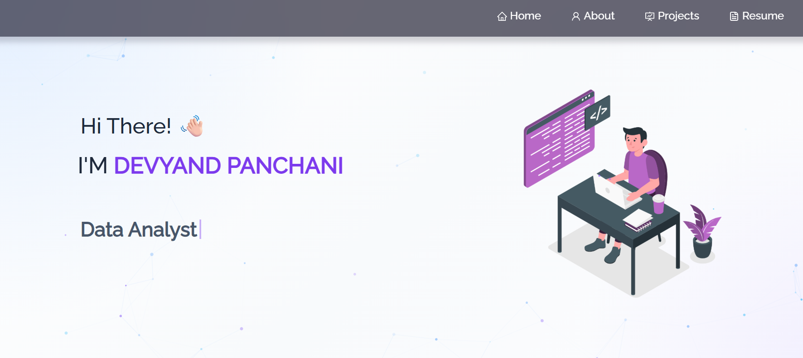

<h2 align="center">
  Portfolio Website - v2.0<br/>
  <a href="" target="_blank"></a> 
  <!-- add live project url -->
</h2>
<div align="center">
  
</div>

<br/>

<center>

[](https://forthebadge.com) &nbsp;
[](https://forthebadge.com) &nbsp;
[](https://forthebadge.com) &nbsp;


</center>

# <h2 align="center">

Portfolio Website - v2.0<br/> <a href="https://github.com/Devyang111" target="_blank">Devyang111</a>

</h2>

<div align="center">
  
</div>

<br/>


## TL;DR

You can fork this repository to modify and customize it according to your needs. If you use this project as a base for your own portfolio, please consider giving proper credit by linking back to this repository.

## Built With

My personal portfolio website showcasing my projects, technical skills, experience, and resume.

This project was built using these technologies:

* React.js
* Node.js
* Express.js
* CSS3
* React-Bootstrap
* VS Code
* Vercel

## Features

**📖 Multi-Page Layout**

**🎨 Styled with React-Bootstrap and CSS with easy-to-customize colors**

**📱 Fully Responsive**

**💼 Showcases Projects, Skills, and Resume**

## Getting Started

Clone down this repository. You will need `node.js` and `git` installed globally on your machine.

## 🛠 Installation and Setup Instructions

1. Installation:

```bash
npm install
```

2. In the project directory, run:

```bash
npm start
```

Runs the app in development mode.

Open:

```text
http://localhost:3000
```

to view it in your browser.

The page will reload automatically if you make edits.

## Usage Instructions

Open the project folder and navigate to:

```text
/src/components/
```

You will find all the components used in the portfolio, and you can edit your information, projects, skills, and social links accordingly.

## Show Your Support

If you like this portfolio, please consider giving this repository a ⭐ on GitHub!

